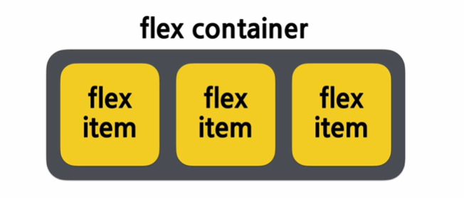
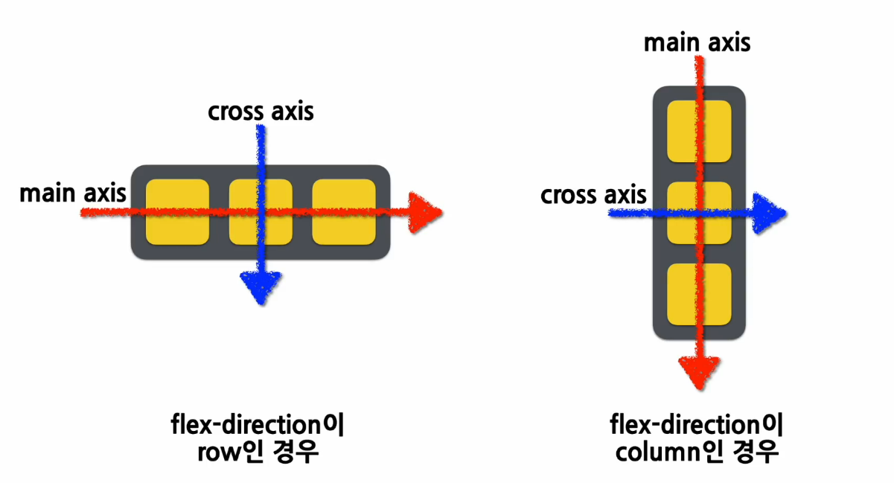
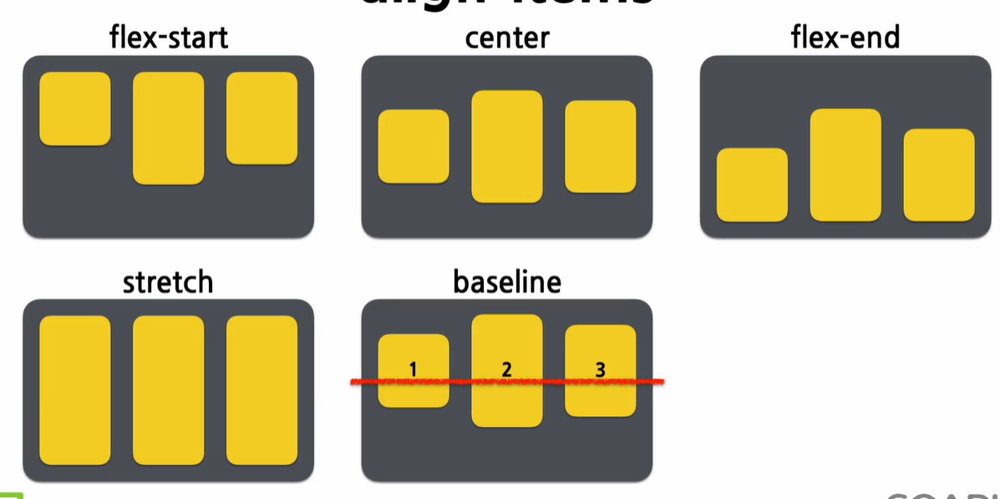
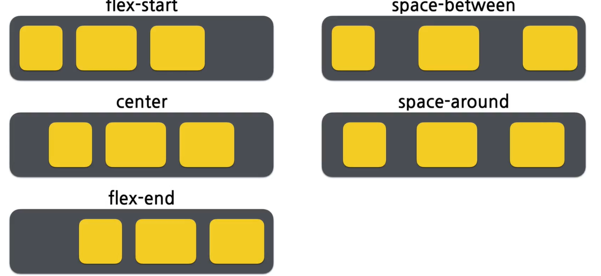

<h3>CSS와 selector</h3>
1. css

- 선택자: 스타일을 어떤 element에 적용할 지 선택하는 것
- h1{color: green; font-size: 16px;}
- //선택자{속성: 값; 속성: 값}

2.  selector의 유형

    - element selector
      ````
      h1{
          color: green;
      }```
      ````
    - ID selector

      ````
      <div id="section">
      ,,,</div>
      #section{
          background-color:black;
      }```

      ````

    - class selector

      ```
      <span class="medium">
      ,,,</span>

      <p class="medium">
      ,,,</p>

      .medium{
          font-size:20px;
      }

      p.medium{
          font-size:20px;
      }
      ```

    * universal selector

      ```* {
          font-size:20px;
          color: blue;
      }
      ```

    * grouping selector

      ```

      h1, h2, p{
      color: black;
      text-align: center;
      }

      ```

    * 상태와 관련된 대표적인 selector

      - hover: 마우스 커서가 element위에 올라왔을 때
      - active: 주로 a 태그(link)에 사용되는데, element가 클릭됐을 때를 의미
      - focus: 주로 input 태그에서 사용되는데, element가 초점을 갖고 있을 경우를 의미
      - checked: radio button 이나 checkbox 같은 유형의 input 태그가 체크되어 있는 경우를 의미 \* first-child, last-child: 상위 element를 기준으로 각각 첫번째 child, 마지막 child일 경우를 의미

              ```
              button: hover{
                  font-weight: bold;
              }

              a:active{
                  color: red;
              }

              input:focus{
                  color: #000000;
              }

              option:checked{
                  background: #00ff00;
              }

              p:first-child{
                  background: #ff0000;
              }

              p:last-child{ #0000ff;
              }
              ```

<h3>레이아웃과 관련된 CSS 속성</h3>

1. layout
   화면에 element들을 어떻게 배치할 것인가?
2. display
   element를 어떻게 표현할지에 대한 방법
   ```
   div{
       display: none | block | inline | flex;
   }
   ```
   - display: none;
     - element를 화면에서 숨기기 위해 사용
     - script 태그의 display 속성 기본값은 display:none;
   - display: block;
     - 블록 단위로 element를 배치
     - p, div, h1~h6 태그의 display 속성 기본값이 display:block;
   - display: inline;
     - element를 라인 안에 넣는 것
     - span 태그의 display 속성 기본 값이 display: inline;
   - display:flex;
     - element를 블록 레벨의 flex container로 표시
     - container이기 때문에 내부에 다른 element들을 포함
3. visibility

   ```
   div{
       visibility: visible | hidden;
   }
   ```

   - visibility: visible;
     - element를 화면에 보이게 하는 것
   - visibility: hidden;
     - 화면에서 안 보이게 감추는 것
     - element를 안 보이게만 하는 것이고, 화면에서의 영역은 그대로 차지

4. position
   ```
   div{
       position: static | fixed | relative | absolute;
   }
   ```
   - static
     - 기본값으로 element를 원래의 순서대로 위치시킴
   - fixed
     - element를 브라우저 window에 상대적으로 위치시킴
   - relative
     - element를 보통의 위치에 상대적으로 위치시킴
   - absoulte
     - element를 절대 위치에 위치시킴
5. 가로 세로 길이와 관련된 속성
   ```div{
        width: auto | value;
        height: auto | value;
        min-width: auto | value;
        min-height: auto | value;
        max-width: auto | value;
        max-height: auto | value;
    }
   ```

> flexbox



```
div{
    display: flex;
    flex-direction: row | column | row-reverse | column-reverse;
    align-items: stretch | flex-start | center | flex-end | baseline;
    justify-content: flex-start | center | flex-end | space-between | space-around;
}
```

1. felx-direction
   - row
     - 기본값이며, 아이템을 행을 따라 가로 순서대로 왼쪽부터 배치
   - column
     - 아이템을 열을 따라 세로 순서대로 위쪽부터 배치
   - row-reverse
     - 아이템을 행의 역방향으로 오른쪽부터 배치
   - column-reverse
     - 아이템을 열의 역방향으로 아래쪽부터 배치
   - 
2. align-items
   - stretch
     - 기본값으로써 아이템을 늘려서 컨테이너 가득 채움
   - flex-start
     - cross axise의 시작 지점으로 아이템을 정렬
   - center
     - cross axise의 중앙으로 아이템을 정렬
   - flex-end
     - cross axis의 끝 지점으로 아이템을 정렬
   - baseline
     - 아이템을 baseline을 기준으로 정렬
   - 
3. justify-content
   - flex-start
     - main axis의 시작 지점으로 아이템을 맞춤
   - center
     - main axis의 중앙으로 아이템을 맞춤
   - flex-end
     - main axis의 끝 지점으로 아이템을 맞춤
   - space-between
     - main axis를 기준으로 첫 아이템은 시작 지점에 맞추고 마지막 아이템은 끝 지점에 마주며, 중간에 있는 아이템들 사이 간격이 일정하게 되도록 맞춤
   - space-around
     - main axis를 기준으로 각 아이템의 주변 간격을 동일하게 맞춤
   - 

<h3>font와 관련된 CSS 속성, 기타</h3>
1. font-family
   ```
   #title {
    font-family: "Times New Roman", Times, serif;
   }

#title2 {
font-family: Arial, Verdana, sans-serif;
}

#title3 {
font-familt: "Courier New", Monaco, monospace;
}```

- 일반적인 글꼴 분류
  - serif
    - 각 글자의 모서리에 작은 테두리를 갖고 있는 형태의 글꼴
  - sans-serif
    - 모서리에 테두리가 없이 깔끔한 선의 글꼴
    - 컴퓨터 모니터에서는 serif 보다 가독성 좋음
  - monospace
    - 모든 글자가 같은 가로 길이를 가지는 글꼴, 코딩할 때 주로 사용
  - cursive
    - 사람이 쓴 손글씨 모양의 글꼴
  - fantasy
    - 장식이 들어간 형태의 글꼴

2. font-szie

- px(pixel)
- em
- rem
- vw(viewpoint width)

3. font-weight
   - normal
     - 일반적인 글자 형태
   - italic
     - 기울어진 형태
   - oblique
     - 비스듬한 형태
   - ```
     #title{
      font-style: italic;
     }
     #title2{
      font-size: oblique;
     }
     ```
4. 기타 많이 쓰는 속성

   - background-color
     - 16진수 컬러값
     - 투명도를 가진 16진수 컬러값
     - RGB 컬러 값
     - RGBA 컬러 값
     - HSL 컬러 값
     - HSLA 컬러 값
     - 미리 정의된 색상의 이름
     - currentcolor 키워드
   - border

   ```
   #section1 {
     background-color: red;
   }

   #section2 {
     border: 1px solid black;
   }
   ```

<h3>styled-components</h3>

> styled-component 기본 사용법

- tagged template literal
- literal

  - 소스코드에 고정된 값

  ```
  //정수 리터럴
  const myNumber=10;

  //문자열 리터럴
  const myStr="hello";

  //배열 리터럴
  const myArray=[];

  //객체 리터럴(Object literal)
  const myObject={};
  ```

- template literal
  - 벡틱으로 문자열 사용, 그 안에 대체 가능한 expression 삽입
  - tagged template literal
    - 앞에 있는 tagged template 호출하여 결과 return
  - untagged template literal
    - 문자열을 여러 줄에 걸쳐서 작성, 포매팅
- styled-components
  - props 사용
- styled-components의 스타일 확장하기

ch.15의 실습 오류 해결 불가...
Uncaught TypeError: Cannot read properties of null (reading 'useContext')
at exports.useContext (react.development.js:1168:1)
at StyledComponent.ts:127:1
at O (StyledComponent.ts:199:1)
at react-stack-bottom-frame (react-dom-client.development.js:23863:1)
at renderWithHooks (react-dom-client.development.js:5529:1)
at updateForwardRef (react-dom-client.development.js:8645:1)
at beginWork (react-dom-client.development.js:10861:1)
at runWithFiberInDEV (react-dom-client.development.js:1518:1)
at performUnitOfWork (react-dom-client.development.js:15130:1)
at workLoopSync (react-dom-client.development.js:14956:1)
